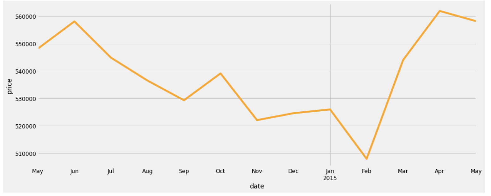

# Machine-Learning-for-classifying-and-predicting-house-prices-in-London

This GitHub repository contains the code and resources for implementing a machine learning project focused on classifying and predicting house prices in London. The project includes data cleaning and preprocessing using Pandas, data visualization using Matplotlib and Seaborn, and the implementation of various machine learning algorithms such as linear regression, logistic regression, random forest, naive Bayes, k-means, k-nearest neighbor, and more.

### Introduction

The objective of this project is to build a machine learning system that can classify and predict house prices in London based on a given set of features. By applying various machine learning algorithms to a cleaned and preprocessed dataset, we aim to analyze the relationship between different features and house prices, identify important predictors, and create accurate prediction models.

### Features
Data cleaning and preprocessing using Pandas
Data visualization using Matplotlib and Seaborn (heatmaps, pie charts, etc.)
Implementation of popular machine learning algorithms
Classification of house prices in London
Prediction models for house price estimation
Evaluation and comparison of different algorithms

### Technologies

The project utilizes the following technologies and libraries:

Python programming language
Pandas for data cleaning and preprocessing
Matplotlib and Seaborn for data visualization
Scikit-learn for implementing machine learning algorithms
Dataset
The project utilizes a dataset containing information about house prices in London. The dataset includes various features such as location, size, number of rooms, amenities, and price. The dataset is available at link-to-dataset.

### Getting Started

To get started with this project, follow these steps:

Clone the repository: git clone https://github.com/your-username/house-price-prediction-london.git
Install the required dependencies: pip install -r requirements.txt
Download the dataset and place it in the appropriate directory.
Run the data cleaning and preprocessing scripts using Pandas.
Visualize the data using Matplotlib and Seaborn to gain insights.
Implement various machine learning algorithms for classification and prediction.
Evaluate the models, compare their performance, and select the best ones.
Usage
Please refer to the documentation in the docs folder for detailed instructions, code explanations, and usage guidelines. The documentation provides step-by-step explanations of data cleaning, preprocessing, visualization, and the implementation of different machine learning algorithms.

### Contributing
Contributions are welcome! If you'd like to contribute to this project, please follow these guidelines:

Fork the repository and create a new branch.
Make your changes and ensure they're properly documented.
Submit a pull request with a detailed description of your changes.

We hope that this repository serves as a useful resource for machine learning-based classification and prediction of house prices in London. Feel free to explore, contribute, and enhance the functionality to improve the accuracy and effectiveness of house price estimation.

For any questions or suggestions, please contact us or open an issue.
